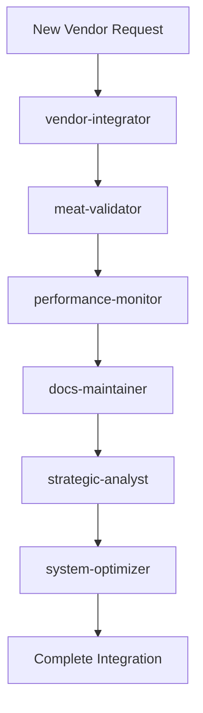

# 🤖 Basarometer AI Subagent Team

**Complete Autonomous Platform Team - 6 Specialized AI Agents**

## 🚀 Team Overview

This directory contains the complete Basarometer AI subagent team designed to transform the platform from manual AI assistance to autonomous AI-driven operations. Each agent specializes in a critical aspect of platform management and works together to maintain enterprise-grade quality and performance.

## 👥 Agent Team Roster

### 1️⃣ [Meat-Validator](./meat-validator.md) 🥩
**Quality Assurance Specialist**
- **Mission**: 100% meat purity validation using 942-term classification
- **Trigger**: New products, quality audits, contamination alerts
- **Tools**: basarometer-filesystem, puppeteer-scraping, memory-sessions

### 2️⃣ [Vendor-Integrator](./vendor-integrator.md) 🕷️
**Expansion Specialist**  
- **Mission**: Systematic vendor addition with bulletproof quality
- **Trigger**: New vendor targets, extraction issues, scaling needs
- **Tools**: puppeteer-scraping, basarometer-filesystem, memory-sessions

### 3️⃣ [Performance-Monitor](./performance-monitor.md) 📊
**System Optimization Specialist**
- **Mission**: Enterprise-grade performance at scale (<50ms API)
- **Trigger**: Performance degradation, scaling events, weekly checkups
- **Tools**: bash, basarometer-filesystem, memory-sessions

### 4️⃣ [Docs-Maintainer](./docs-maintainer.md) 📝
**Documentation Excellence Specialist**
- **Mission**: Enterprise-grade documentation automation
- **Trigger**: System changes, new features, milestone achievements
- **Tools**: basarometer-filesystem, github-management, memory-sessions

### 5️⃣ [Strategic-Analyst](./strategic-analyst.md) 🎯
**Business Intelligence Specialist**
- **Mission**: Data-driven strategic recommendations and market analysis
- **Trigger**: Strategic decisions, expansion planning, competitive threats
- **Tools**: basarometer-filesystem, memory-sessions, github-management

### 6️⃣ [System-Optimizer](./system-optimizer.md) 🔧
**Technical Excellence Specialist**
- **Mission**: Bulletproof technical infrastructure maintenance
- **Trigger**: Build issues, TypeScript warnings, technical debt
- **Tools**: bash, basarometer-filesystem, github-management, memory-sessions

## 🔄 Agent Coordination Workflows

### Automatic Agent Chaining


### Proactive Trigger Matrix
| Agent | Daily | Weekly | Event-Driven |
|-------|-------|--------|-------------|
| meat-validator | Quality monitoring | Quality audits | New products |
| vendor-integrator | - | - | New vendor needs |
| performance-monitor | Health checks | System reviews | Performance issues |
| docs-maintainer | - | Doc reviews | System changes |
| strategic-analyst | - | Market analysis | Strategic decisions |
| system-optimizer | - | Maintenance | Technical issues |

## 🎯 Usage Guidelines

### When to Use Specific Agents

#### **MUST BE USED** (Critical Operations)
- **meat-validator**: Every new product before database integration
- **vendor-integrator**: All vendor expansion activities  
- **docs-maintainer**: After any system changes or new features
- **system-optimizer**: For technical issues and build problems

#### **SHOULD BE USED** (Recommended Operations)  
- **performance-monitor**: Weekly system checkups and after changes
- **strategic-analyst**: Monthly strategic reviews and major decisions
- **system-optimizer**: Weekly preventive maintenance

#### **AUTO-TRIGGER** (Automatic Activation)
- **meat-validator**: When vendor-integrator extracts new products
- **performance-monitor**: On performance threshold breaches
- **docs-maintainer**: When other agents complete major work
- **system-optimizer**: On build failures or TypeScript errors

## 🏆 Success Metrics

### Team Performance KPIs
```javascript
{
  "agent_response_time": "<30s per agent",
  "task_completion_rate": "99%+", 
  "quality_consistency": "100% meat purity maintained",
  "documentation_accuracy": "100% current and accurate",
  "system_performance": "<50ms API response maintained",
  "strategic_value": "Actionable insights in every analysis"
}
```

### Business Impact Metrics
```javascript
{
  "vendor_integration_time": "3 hours → 30 minutes",
  "quality_assurance": "Manual → Automatic",
  "documentation_maintenance": "Manual → Automatic",
  "strategic_planning_time": "Days → Hours", 
  "technical_maintenance": "Reactive → Proactive",
  "overall_efficiency": "10x improvement in operational speed"
}
```

## 🚀 Quick Start Commands

### Deploy Complete Team for New Vendor
```bash
# Use vendor-integrator to extract products
# meat-validator automatically validates extracted products
# performance-monitor checks system impact
# docs-maintainer updates integration documentation
# strategic-analyst assesses business impact
# system-optimizer handles any technical issues
```

### Weekly System Maintenance
```bash
# performance-monitor: Weekly system health check
# strategic-analyst: Weekly market analysis  
# system-optimizer: Weekly technical maintenance
# docs-maintainer: Weekly documentation review
```

### Emergency Response
```bash
# system-optimizer: Technical issues and build problems
# performance-monitor: Performance degradation alerts
# meat-validator: Quality contamination alerts
# All agents coordinate for emergency response
```

## 🎮 Agent Integration Examples

### Example 1: Tiv Taam Integration
1. **vendor-integrator** → Extract Tiv Taam products with stealth scraping
2. **meat-validator** → Validate 100% meat purity using 942-term system
3. **performance-monitor** → Monitor system performance impact
4. **docs-maintainer** → Update vendor integration documentation
5. **strategic-analyst** → Analyze business impact and ROI
6. **system-optimizer** → Optimize any technical issues

### Example 2: Quality Audit
1. **meat-validator** → Comprehensive quality audit of all products
2. **performance-monitor** → Track audit performance impact
3. **strategic-analyst** → Assess quality trends and business implications
4. **docs-maintainer** → Update quality documentation and procedures
5. **system-optimizer** → Optimize validation performance

## 📊 Operational Dashboard

### Agent Status Monitoring
- Individual agent health and performance
- Task completion rates and success metrics
- Integration workflow status
- Error rates and resolution times

### System Impact Tracking  
- API performance maintained <50ms
- Build performance <1 second
- Quality standards 100% maintained
- Documentation accuracy 100%

## 🔧 Technical Architecture

### MCP Tool Distribution
Each agent has access to specialized MCP tools optimized for their mission:
- **Basarometer Filesystem**: Project-specific file operations
- **Puppeteer Scraping**: Advanced web scraping capabilities
- **Memory Sessions**: Persistent knowledge and pattern storage
- **GitHub Management**: Version control and collaboration
- **Standard Tools**: Bash, file operations, system access

### Security and Compliance
- All agents operate within secure sandboxed environments
- Access controls limit agent permissions to required tools only
- Audit logging tracks all agent activities and decisions
- Data privacy and security standards maintained across all operations

---

## 🎯 Vision Achievement

**From 194 products to autonomous 1000+ product capability**
**From manual AI assistance to autonomous AI-driven platform**
**10x operational efficiency + enterprise-grade quality + unlimited scalability**

🚀 **The future of Basarometer is NOW!** 🎯