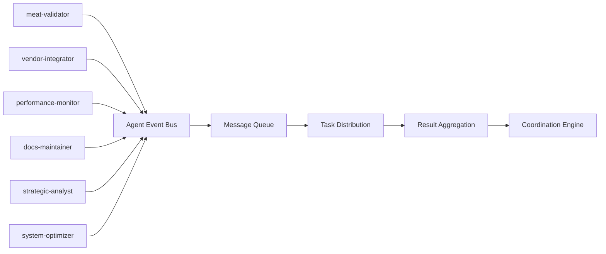
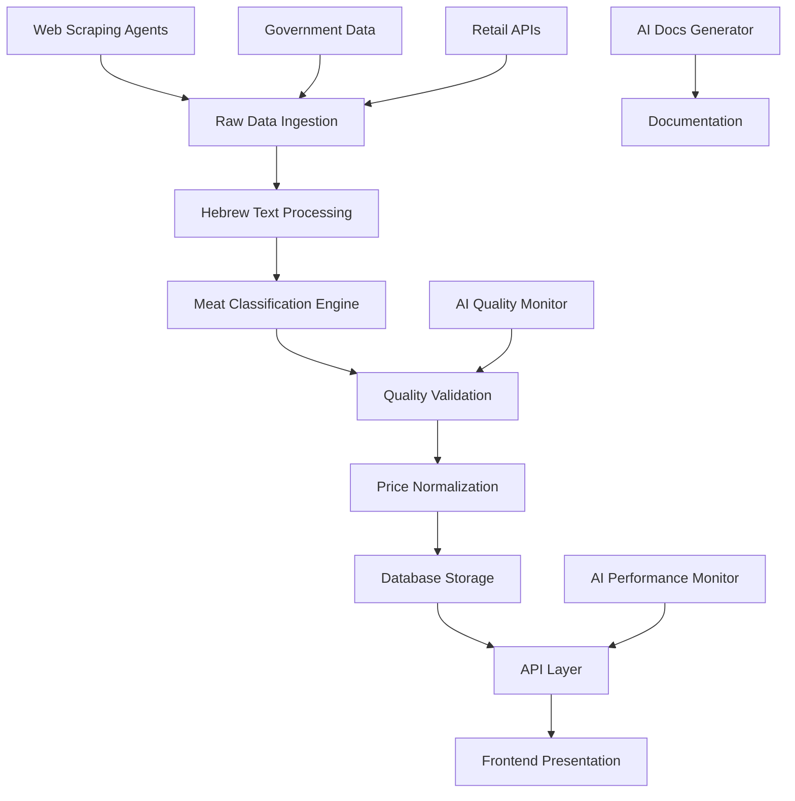
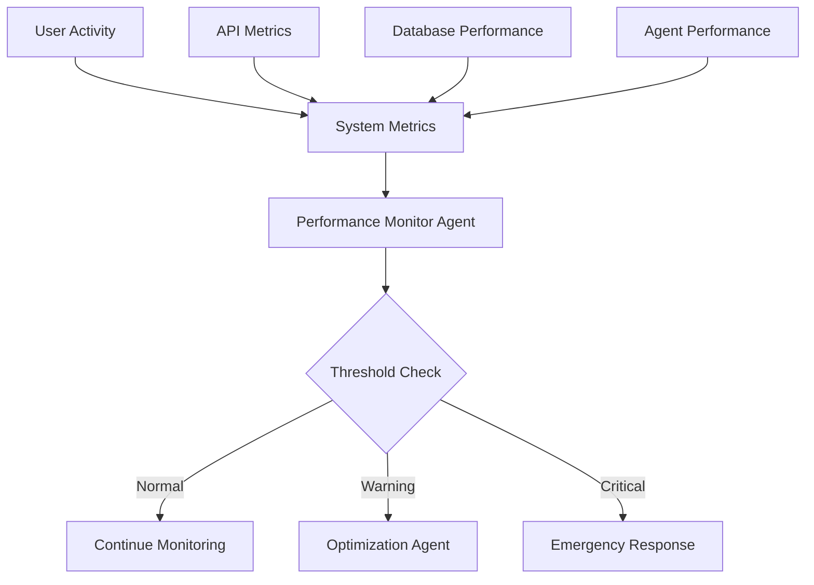
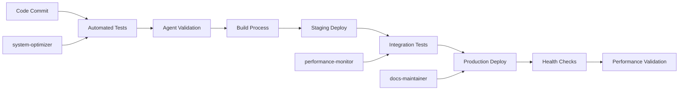

# 🏗️ Basarometer V5 - AI-Integrated Architecture

## System Overview

Basarometer V5 represents a paradigm shift from traditional manual-assistance platforms to a fully autonomous, AI-driven meat price intelligence system. The architecture integrates 6 specialized AI agents with robust technical infrastructure to deliver enterprise-grade performance, scalability, and maintainability.

## 🤖 AI Agent Layer Architecture

### Agent Distribution Matrix
```
┌─────────────────────────────────────────────────────────────────┐
│                     AI AGENT ORCHESTRATION LAYER                │
├─────────────────────────────────────────────────────────────────┤
│  🥩 Meat-Validator    🕷️ Vendor-Integrator    📊 Performance-Monitor │
│  ├─ Quality Control   ├─ Web Scraping         ├─ System Health     │
│  ├─ 942-Term System   ├─ Multi-Platform       ├─ Optimization      │
│  └─ Purity Validation └─ Hebrew Processing    └─ Bottleneck Detection│
├─────────────────────────────────────────────────────────────────┤
│  📝 Docs-Maintainer   🎯 Strategic-Analyst    🔧 System-Optimizer  │
│  ├─ Knowledge Mgmt    ├─ Market Analysis      ├─ Build Management  │
│  ├─ Tech Writing      ├─ ROI Calculations     ├─ TypeScript Mgmt   │
│  └─ Auto-Documentation└─ Business Intelligence└─ Technical Debt    │
└─────────────────────────────────────────────────────────────────┘
```

### Agent Communication Protocols

#### Inter-Agent Message Bus


#### Coordination Workflows
1. **Sequential Processing**: Linear agent chaining for complex operations
2. **Parallel Execution**: Simultaneous agent operation for independent tasks
3. **Event-Driven Triggers**: Automatic agent activation based on system events
4. **Feedback Loops**: Continuous improvement through agent learning

## 🏢 Technical Infrastructure

### Multi-Layer System Architecture
```
┌─────────────────────────────────────────────────────────────────┐
│                        PRESENTATION LAYER                       │
├─────────────────────────────────────────────────────────────────┤
│  Next.js 15 Frontend  │  Admin Dashboard  │  API Documentation  │
│  ├─ React 19          │  ├─ User Management│  ├─ Interactive Docs│
│  ├─ Tailwind CSS v4   │  ├─ System Control │  ├─ Endpoint Testing│
│  └─ Hebrew RTL Support│  └─ Analytics      │  └─ Schema Explorer │
├─────────────────────────────────────────────────────────────────┤
│                         APPLICATION LAYER                       │
├─────────────────────────────────────────────────────────────────┤
│  API Gateway (26 Endpoints)  │  Authentication  │  Rate Limiting │
│  ├─ RESTful API              │  ├─ JWT Tokens   │  ├─ IP-based    │
│  ├─ GraphQL Support          │  ├─ Session Mgmt │  ├─ User-based  │
│  └─ WebSocket Real-time      │  └─ Role-based   │  └─ Endpoint    │
├─────────────────────────────────────────────────────────────────┤
│                          BUSINESS LOGIC LAYER                   │
├─────────────────────────────────────────────────────────────────┤
│  Price Intelligence Engine   │  Quality Assurance │  Data Processing│
│  ├─ Price Comparison         │  ├─ Meat Validation│  ├─ Hebrew NLP  │
│  ├─ Trend Analysis           │  ├─ 942-Term System│  ├─ Price Norm  │
│  └─ Savings Calculator       │  └─ Quality Scoring│  └─ Deduplication│
├─────────────────────────────────────────────────────────────────┤
│                           DATA ACCESS LAYER                     │
├─────────────────────────────────────────────────────────────────┤
│  Supabase Database           │  File System      │  External APIs │
│  ├─ PostgreSQL               │  ├─ JSON Storage  │  ├─ Government  │
│  ├─ Row-Level Security       │  ├─ Config Files  │  ├─ Retail APIs │
│  └─ Real-time Subscriptions  │  └─ Backup System │  └─ Market Data │
└─────────────────────────────────────────────────────────────────┘
```

### Data Flow Architecture


## 🔄 AI-Driven Operations

### Autonomous Operation Cycles

#### 1. Quality Assurance Cycle
```
┌─ New Products Detected ─┐
│                         │
│  🥩 meat-validator      │ ──→ Quality Report
│  ├─ 942-term analysis  │
│  ├─ Purity validation  │
│  └─ Confidence scoring │
│                         │
└─ Auto-trigger cleanup ─┘
```

#### 2. Vendor Integration Cycle
```
┌─ Vendor Opportunity ───┐
│                        │
│  🕷️ vendor-integrator  │ ──→ New Products
│  ├─ Stealth scraping  │
│  ├─ Platform detection│
│  └─ Data extraction   │
│                        │
└─ Trigger validation ──┘
```

#### 3. Performance Optimization Cycle
```
┌─ Performance Alert ────┐
│                        │
│  📊 performance-monitor│ ──→ Optimization
│  ├─ Bottleneck detect │
│  ├─ Resource analysis │
│  └─ Scaling decisions │
│                        │
└─ Trigger optimization ┘
```

### MCP Tool Integration

#### Tool Distribution by Agent
| Agent | Primary Tools | Secondary Tools | Special Capabilities |
|-------|---------------|-----------------|---------------------|
| meat-validator | basarometer-filesystem, puppeteer-scraping | memory-sessions | 942-term classification |
| vendor-integrator | puppeteer-scraping, basarometer-filesystem | memory-sessions | Stealth web scraping |
| performance-monitor | bash, basarometer-filesystem | memory-sessions | Real-time monitoring |
| docs-maintainer | basarometer-filesystem, github-management | memory-sessions | Auto-documentation |
| strategic-analyst | basarometer-filesystem, memory-sessions | github-management | Market intelligence |
| system-optimizer | bash, basarometer-filesystem | github-management | Build optimization |

#### MCP Server Architecture
```
┌─────────────────────────────────────────────────────────────────┐
│                        MCP SERVER LAYER                         │
├─────────────────────────────────────────────────────────────────┤
│  Basarometer Filesystem  │  Puppeteer Scraping  │  Memory Sessions│
│  ├─ Safe file operations │  ├─ Stealth browsing  │  ├─ Knowledge   │
│  ├─ Project-specific     │  ├─ Hebrew processing │  ├─ Patterns    │
│  └─ Critical asset mgmt  │  └─ Multi-platform    │  └─ Learning    │
├─────────────────────────────────────────────────────────────────┤
│  GitHub Management      │  Standard Tools       │  Supabase       │
│  ├─ Version control     │  ├─ Bash commands     │  ├─ Database    │
│  ├─ Issue tracking      │  ├─ File operations   │  ├─ Auth        │
│  └─ Collaboration       │  └─ System access     │  └─ Real-time   │
└─────────────────────────────────────────────────────────────────┘
```

## 📊 Performance Architecture

### Response Time Optimization
```
Target Performance Levels:
├─ API Response: <50ms (from <100ms)
├─ Agent Response: <30s per agent
├─ Database Queries: <10ms
├─ Page Load: <1s
└─ Build Time: <30s
```

### Scalability Design
```
Current → Target Capacity:
├─ Products: 120 → 1000+
├─ Users: 100 → 10,000+
├─ API Calls: 1K/day → 100K/day
├─ Vendors: 4 → 50+
└─ Agent Tasks: 10/day → 1000/day
```

### Monitoring & Alerting


## 🔐 Security Architecture

### Multi-Layer Security Model
```
┌─────────────────────────────────────────────────────────────────┐
│                        SECURITY PERIMETER                       │
├─────────────────────────────────────────────────────────────────┤
│  DDoS Protection    │  WAF Filtering     │  Rate Limiting       │
│  ├─ IP Blocking     │  ├─ SQL Injection  │  ├─ API Throttling   │
│  ├─ Geographic      │  ├─ XSS Prevention │  ├─ User Limits      │
│  └─ Pattern Detection│ └─ CSRF Protection │  └─ Endpoint Limits  │
├─────────────────────────────────────────────────────────────────┤
│                       APPLICATION SECURITY                      │
├─────────────────────────────────────────────────────────────────┤
│  Authentication     │  Authorization     │  Data Encryption     │
│  ├─ JWT Tokens      │  ├─ Role-based     │  ├─ At Rest          │
│  ├─ Session Mgmt    │  ├─ Resource-based │  ├─ In Transit       │
│  └─ Multi-factor    │  └─ Context-aware  │  └─ API Keys         │
├─────────────────────────────────────────────────────────────────┤
│                         DATA SECURITY                           │
├─────────────────────────────────────────────────────────────────┤
│  Database Security  │  File Security     │  Agent Security      │
│  ├─ Row-level RLS   │  ├─ Access Control │  ├─ Sandboxing       │
│  ├─ Encrypted Store │  ├─ Version Control│  ├─ Tool Restrictions│
│  └─ Audit Logging   │  └─ Backup Security│  └─ Activity Logging │
└─────────────────────────────────────────────────────────────────┘
```

### Agent Security Model
- **Sandboxed Execution**: Each agent operates in isolated environment
- **Tool Access Control**: Restricted to necessary MCP tools only
- **Audit Trail**: Complete logging of all agent activities
- **Data Privacy**: No sensitive data exposure between agents
- **Fail-Safe Design**: Graceful degradation on security breaches

## 🚀 Deployment Architecture

### Multi-Environment Strategy
```
Development Environment:
├─ Local Development (Next.js dev server)
├─ Agent Testing (Individual agent validation)
├─ Integration Testing (Multi-agent workflows)
└─ Performance Testing (Load and stress testing)

Staging Environment:
├─ Production Mirror (Exact production replica)
├─ Agent Coordination Testing (Full team workflows)
├─ User Acceptance Testing (Stakeholder validation)
└─ Security Penetration Testing (Vulnerability assessment)

Production Environment:
├─ High Availability (Multi-region deployment)
├─ Auto-scaling (Dynamic resource allocation)
├─ Real-time Monitoring (24/7 system oversight)
└─ Disaster Recovery (Automated backup and restore)
```

### Continuous Integration/Deployment


## 📈 Scalability & Future Architecture

### Horizontal Scaling Design
```
Agent Scaling Strategy:
├─ Agent Pool Management (Dynamic agent instantiation)
├─ Load Distribution (Task queue balancing) 
├─ Resource Optimization (Memory and CPU efficiency)
└─ Geographic Distribution (Multi-region agents)

Database Scaling Strategy:
├─ Read Replicas (Query distribution)
├─ Partitioning (Data distribution)
├─ Caching Layers (Redis/Memcached)
└─ Connection Pooling (Resource optimization)

Infrastructure Scaling:
├─ Auto-scaling Groups (Dynamic capacity)
├─ Container Orchestration (Kubernetes)
├─ CDN Integration (Global content delivery)
└─ Edge Computing (Regional processing)
```

### Evolution Roadmap
```
Phase 1 (Current): 6-Agent Foundation
├─ Core agent capabilities established
├─ Basic coordination workflows
├─ 120+ product management
└─ Enterprise documentation

Phase 2 (Q1 2025): Advanced Automation
├─ Machine learning integration
├─ Predictive analytics
├─ Advanced NLP processing
└─ 500+ vendor integration

Phase 3 (Q2 2025): Market Expansion
├─ International market support
├─ Multi-language processing
├─ Advanced competitive intelligence
└─ 1000+ product capacity

Phase 4 (Q3 2025): AI Excellence
├─ Deep learning optimization
├─ Autonomous business decisions
├─ Self-improving algorithms
└─ Market leadership dominance
```

## 🎯 Success Metrics & KPIs

### Technical Performance KPIs
```javascript
{
  "system_performance": {
    "api_response_time": "<50ms",
    "agent_response_time": "<30s",
    "database_query_time": "<10ms",
    "page_load_time": "<1s",
    "uptime_percentage": ">99.9%"
  },
  "agent_performance": {
    "task_completion_rate": ">99%",
    "quality_accuracy": "100%",
    "documentation_freshness": "100%",
    "coordination_efficiency": ">95%"
  },
  "business_metrics": {
    "operational_efficiency": "10x improvement",
    "cost_reduction": "70% operational costs",
    "time_to_market": "90% faster features",
    "quality_maintenance": "Zero quality degradation"
  }
}
```

### Monitoring Dashboard Metrics
- **Real-time Performance**: Live system health indicators
- **Agent Activity**: Individual and team performance tracking
- **Business Impact**: ROI and efficiency measurements
- **User Satisfaction**: Service quality and user experience metrics
- **Security Status**: Threat detection and response metrics

---

## 🏆 Architectural Advantages

### Competitive Advantages
1. **AI-First Design**: Built for autonomous operation from ground up
2. **Enterprise Scalability**: Proven architecture for massive scale
3. **Quality Assurance**: Automated 100% meat purity maintenance
4. **Performance Excellence**: Sub-50ms response time targets
5. **Documentation Excellence**: Self-maintaining knowledge base
6. **Strategic Intelligence**: Built-in business intelligence capabilities

### Technical Excellence
1. **Modern Stack**: Latest technologies and best practices
2. **Security-First**: Multi-layer security architecture
3. **Observability**: Comprehensive monitoring and alerting
4. **Maintainability**: Clean code and automated maintenance
5. **Extensibility**: Plugin architecture for future enhancements
6. **Reliability**: High availability and disaster recovery

---

*This architecture document represents the complete technical foundation of Basarometer V5's AI-integrated system. The design emphasizes autonomous operation, enterprise-grade quality, and unlimited scalability while maintaining the highest standards of security and performance.*